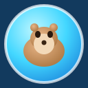

# 🦫 CAPYBALL

A juicy, chunky, Sega-bright **Super Monkey Ball** clone starring a capybara.
Roll a capybara around inside a glowing ball, collect melons, hit boost pads,
ricochet off bumpers, and reach the glowing goal across three escalating stages.

Built in **Godot 4.3 (.NET)** with **C#**. Visuals are authored disk assets —
**`.tres` material files** (editable in the Inspector), an **exported capybara
`.tscn` mesh scene**, and **PNG textures** (checker floors, grids, hazard stripes,
wall rails — generated by `tools/gen_textures.py`). Audio is fully synthesized at
runtime (no `.wav`/`.ogg` files). Geometry primitives stay inline; the
*materials and textures* live on disk in `assets/`.



---

## ✨ Features

**Game feel / "juice"**
- Procedural **squash & stretch** on jumps, landings, boosts, and bumps
- **Screen shake** with trauma² falloff, driven through a central `Fx` autoload
- **Hit-stop** (brief slow-motion) on big impacts, goals, and bumper hits
- **Glow / bloom** post-processing with boosted saturation and filmic tonemapping
- **Particle bursts** on every contact, pickup, launch, and level clear
- **Confetti** showers and a triumphant arpeggio on goal reach
- **Camera lead-ahead** based on ball velocity for a sense of speed
- Speed-reactive **trail** and **boost flame jet**

**Audio — fully synthesized**
- A tiny runtime synth (`Synth.cs`) generates every SFX from waveforms:
  rolling rumble, bumps, landings, boost sweeps, pickup arps, goal fanfares,
  fall whistles, UI clicks, whooshes. No `.wav`/`.ogg` files ship.
- Dedicated SFX bus with a hard limiter so stacked sounds never clip.

**Presentation — fully procedural**
- Capybara model (body, head, snout, ears, glossy eyes) built from primitives
- Chunky beveled platforms with emissive glow rims in a saturated candy palette
- Spinning glow-rings, energy beams, point lights on every interactive prop
- Gradient skies, fog, sun + ambient lighting, ambient sparkles for depth

**Gameplay**
- **Tilt the world** (authentic Super Monkey Ball): input visibly banks the whole
  course like a seesaw under the ball, which then rolls down the real slope via
  standard physics. The ball + camera sit outside the tilt, so the camera stays
  upright and you watch the world tilt. No jump, no boost — pure tilt + momentum.
- Roll **through a glowing goal gate** from either side to finish
- Perimeter **walls** fence each level in
- Level props: boost pads (sling you forward), bumpers (ricochet), moving platforms
- Fall detection into the void → retry
- Best-time + completion persistence (`user://progress.cfg`)

---

## 🎮 Controls

| Action | Keyboard | Gamepad |
|--------|----------|---------|
| Tilt to roll | `WASD` / Arrow keys | Left stick / D-pad |
| Restart level | `R` | — |
| Back to menu | `Esc` | — |

> No jump, no boost button — pure tilt, like the arcade original.

---

## 🗺️ The three levels

Each stage is a walled field; tilt to roll, build momentum, and pass through the
glowing goal gate (from either side). Each is bigger and trickier than the last.

1. **First Roll** — a wide, forgiving field with gentle speed-bump ramps. Teaches
   the tilt feel: lean forward to accelerate, back to brake.
2. **Rise and Roll** — a big launch ramp you tilt up, two bumpers to ricochet off,
   and a moving platform bridge. Bends so camera-relative steering matters.
3. **Bank and Bump** — the showpiece. A course that bends left then right through a
   bumper gauntlet, chained boost pads, a moving-platform hop, and a finale gate on
   a raised pedestal ringed by glowing pillars.

---

## 🛠️ Opening in Rider / VS

This is a standard Godot C# project. The `Capyball.sln` + `Capyball.csproj`
target **net8.0** with `Godot.NET.Sdk` 4.3.0.

```
# From Rider: File → Open → Capyball.sln
# Or build on the command line:
dotnet build
```

To open the project in the Godot editor (to run/edit scenes):
- **Godot 4.3 (.NET)** — open the project folder. The C# solution is picked up
  automatically.

---

## 🚀 Running

The fastest way to run:

```bash
# With Godot 4.3 .NET installed and on PATH:
godot --path . res://Main.tscn
```

Or from the Godot editor: press **F5** (the main scene is `res://Main.tscn`).

**Headless / CI smoke test** (loads each level and runs physics with no GPU):

```bash
godot --headless --quit-after 150 res://Main.tscn
```

---

## 📁 Project structure

```
.
├── project.godot          # Godot project config: autoloads, input map, rendering
├── Capyball.sln / .csproj # C# solution for Rider / VS
├── Main.tscn / Main.cs    # Root scene + game-flow controller (menu ↔ level)
├── icon.svg               # Procedural app icon
├── assets/                # Disk-based authored assets (editable in Inspector)
│   ├── materials/         # .tres StandardMaterial3D + ParticleProcessMaterial
│   │                      #   (static looks + tint templates for per-level colours)
│   └── meshes/
│       └── capybara.tscn  # Exported capybara model scene (10 meshes)
├── tools/
│   └── ExportCapybara.cs  # One-shot headless tool: builds & saves capybara.tscn
└── src/
    ├── Palette.cs         # Shared Sega-bright colour palette (source of truth)
    ├── Assets.cs          # Disk-resource loader: Material / MaterialTinted / Mutable
    ├── Procedural.cs      # Inline primitive-mesh assemblers using disk materials
    ├── Fx.cs              # Centralized particle bursts / shake / hit-stop
    ├── Synth.cs           # Runtime procedural audio engine
    ├── GameState.cs       # Progress / best-time persistence autoload
    ├── Actors/
    │   ├── CapyballBall.cs   # The player: rolling physics, juice, trail
    │   └── CameraFollow.cs   # Smooth chase cam + screen shake
    ├── Levels/
    │   ├── LevelSpec.cs      # Declarative level data + registry
    │   ├── LevelScene.cs     # Runtime: builds geometry, runs the loop, HUD
    │   ├── Level1.cs / Level2.cs / Level3.cs
    │   ├── Goal.cs / Melon.cs / BoostPad.cs / Bumper.cs / MovingPlatform.cs
    ├── Effects/
    │   └── Stage.cs          # Environment, sky, lighting, post-processing
    └── UI/
        ├── MainMenu.cs       # Animated title + level select
        └── Hud.cs            # In-level timer / melon HUD + win/lose overlays
```

---

## 🎨 Editing the look

All materials are plain-text `.tres` files in `assets/materials/`. Open any in
the Godot Inspector (or even a text editor) to tweak colour, emission, roughness,
particle spread, etc. — no code changes needed. A few call out the intended use:

- **Static looks** (`capy_*`, `ball_shell`, `goal_*`, `melon*`, `void_plane`,
  `sparkle`, `chevron`, `bumper_ring`) are shared read-only resources.
- **Tint templates** (`platform`, `platform_rim`, `booster`, `bumper_core`,
  `burst`) are recoloured per-instance by `Assets.MaterialTinted(...)` so each
  platform/booster/bumper keeps its own coloured copy. Edit the *structure*
  (roughness, emission flags) here; the colour comes from the level spec.
- **Mutable** materials (`trail`, `ball_shell`) are duplicated per-instance
  because they're animated at runtime.

To re-export the capybara mesh (e.g. after changing its primitive params):

```bash
godot --headless --script res://tools/ExportCapybara.cs
```

### Textures

Surface textures (checker floors, grids, hazard stripes, wall rails) are PNGs in
`assets/textures/`, generated by `tools/gen_textures.py` — geometric Sega-arcade
patterns authored in code rather than hand-painted. Regenerate with:

```bash
python3 tools/gen_textures.py
```

Platform materials multiply their tint over the texture, so each level's colour
scheme is preserved while the checker/grid detail shows through. UV tiling is
set per-platform in `LevelScene`/`Procedural` so checkers repeat at a sensible
world size (~4 units) rather than stretching.

---

## 🧪 Design notes

- **Levels are data, not scenes.** Each level is a plain C# `LevelSpec`
  consumed by a single `LevelScene` runtime. Authoring stays terse and
  diff-friendly; the whole game fits in a handful of scripts.
- **Mixed asset strategy.** Materials and the capybara model live on disk
  (Inspector-editable `.tres`/`.tscn`); trivial primitive geometry stays inline;
  all audio is synthesized at runtime. This keeps the look tunable without code
  while staying asset-light.
- **`Palette.cs` remains the source of truth for colour** — the `.tres` files
  encode those exact values, and per-instance tinting reads from the palette via
  the level specs.
- **Physics:** the ball is a plain `RigidBody3D` under standard world-down gravity.
  The tilt mechanic banks the **course geometry** (under a tilt pivot), so the ball
  rolls down the real, visible slope. The ball + camera live outside the pivot, so
  the camera stays upright while the world banks — authentic SMB. The pivot rotates
  around the ball's position so the surface stays under it as it tilts.
- **Tilt is camera-relative** — "forward" always means "away from the camera".

## 🎚️ Tuning the feel

Tilt feel lives on `LevelScene` (`MaxTiltDeg`, `TiltSpeed`) and the ball
(`GravityMultiplier`, `LinearDamp`, `MaxSpeed` in `CapyballBall.cs`) — all editable:

- `MaxTiltDeg` (26) — steeper bank = faster roll
- `TiltSpeed` (8) — higher = the course banks more instantly
- `GravityMultiplier` (1.4) — pull strength; heavier = snappier
- `LinearDamp` (0.15) — rolling resistance; higher = coasts less
- `MaxSpeed` (22) — soft cap on horizontal speed

---

## ⚠️ Requirements

- **Godot 4.3 (.NET / mono)** — the project uses the C# bindings.
- **.NET 8 SDK** (the Godot .NET editor bundles this).

Made with rolling capybaras and saturated colours. Enjoy. 🍉
